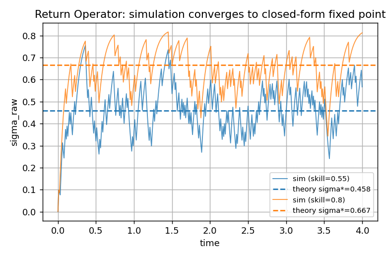
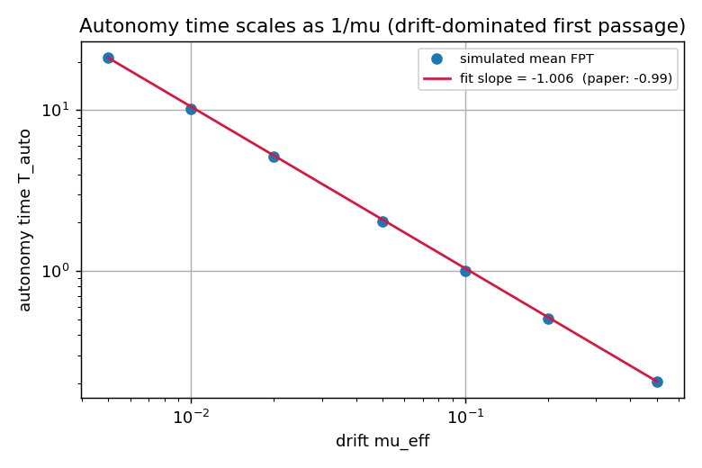
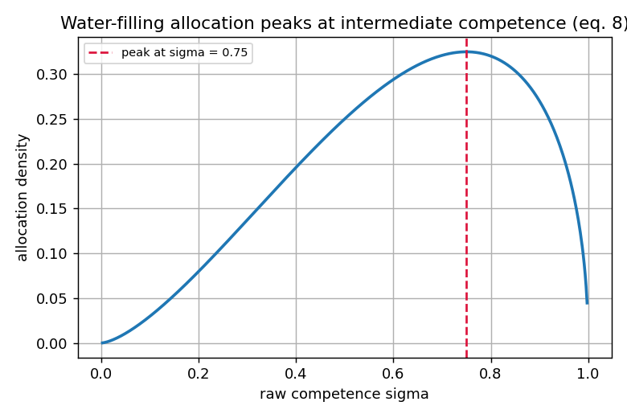
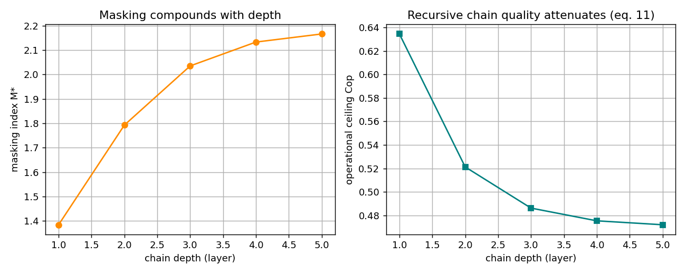

# delegation-lab

Reference implementation of the **Minimum Sufficient Oversight (MSO)** framework
from Azevedo (2026), *"Minimal Oversight: Uncertainty-Aware Governance for
Delegated AI Systems"* ([arXiv:2606.15563](https://arxiv.org/abs/2606.15563)).

The paper's closed-form quantities are implemented as a **pure functional core**
and exposed through **two independent adapters** (a FastAPI HTTP service and a
Typer CLI). A stdlib-only mean-field simulator validates the theory empirically.

## Architecture — functional core, imperative shell

```
src/delegation_lab/
  domain/            # PURE core: no I/O, no framework deps, all the math
    return_operator.py   # eq. 5, 6  + masking index M*
    allocation.py        # eq. 3, 8  Fisher metric, water-filling, threshold
    dag.py               # eq. 7, 11 effective skill, propagation O(V+E), chain
    capacity.py          # eq. 13,14,16,17 capacity, process entropy, autonomy
  simulation.py      # application layer: mean-field simulator (validates core)
  api/               # adapter: FastAPI HTTP shell (7 endpoints)
  cli.py             # adapter: Typer CLI (6 commands)
```

The domain knows nothing about HTTP or terminals. Domain contracts raise plain
`ValueError`; each adapter translates that into its own vocabulary (HTTP 422,
non-zero exit code). You can add a third shell (queue worker, notebook) without
touching the core.

## Equation → function map

| Paper | Quantity | Function |
|---|---|---|
| eq. 5  | Raw competence fixed point | `return_operator.raw_fixed_point` |
| eq. 6  | Corrected quality | `return_operator.corrected_quality` |
| —      | Masking index M* | `return_operator.masking_index` |
| eq. 3  | Fisher metric | `allocation.fisher_metric` |
| eq. 8  | Water-filling allocation | `allocation.governed_allocation` / `allocate` |
| —      | Corrector threshold K/N | `allocation.corrector_threshold` |
| eq. 7  | Effective skill (DAG) | `dag.effective_skill` / `aggregate` |
| eq. 11 | Recursive chain ceiling | `dag.chain_ceiling` |
| eq. 13 | Delegation capacity | `capacity.delegation_capacity` |
| eq. 14 | Process entropy H(W) | `capacity.process_entropy` / `shannon_entropy` |
| eq. 16 | Autonomy buffer B_eff | `capacity.autonomy_buffer` |
| eq. 17 | Autonomy time T_auto | `capacity.autonomy_time` |

## Quick start (Windows / PowerShell)

```powershell
uv venv
.\.venv\Scripts\Activate.ps1
uv pip install -e ".[api,cli,dev,viz]"
```

Run the API:

```powershell
uvicorn delegation_lab.api.main:app --reload   # docs at http://127.0.0.1:8000/docs
# or:
delegation-lab serve --reload
```

Run the CLI:

```powershell
delegation-lab masking  --skill 0.8 --catch-rate 0.7
delegation-lab autonomy --ceiling 0.86 --p-min 0.75 --lam 0.02 --entropy 2.3
delegation-lab --help
```

## Quality gate

```powershell
ruff check . ; ruff format --check .   # lint + annotations (ANN) + format
mypy                                   # strict type checking
pytest                                 # 53 tests
```

CI (`.github/workflows/ci.yml`) runs all three on Python 3.10 / 3.11 / 3.12.

## Reproducing the figures

```powershell
python scripts/generate_figures.py     # writes figures/*.png from the code
```

| | |
|---|---|
|  |  |
|  |  |

Validated results: simulated steady state matches the closed-form fixed point;
autonomy time scales as 1/mu with a log-log slope of **-1.006** (paper: -0.99);
water-filling peaks at sigma = 0.75; capacity grows with the review budget.

## Reproduced worked examples

- Masking: sigma*_raw = 0.667, sigma*_corr = 0.90, M* = 1.35.
- Corrector threshold: K/N = 0.855 (p_min=0.80, raw=0.55, c=0.65).
- Process capacity: H_max = 15 bits (C=0.80, p=0.50, lambda=0.02).
- Semi-real workflow: B_eff = 0.064, T_auto = 5.33.

## Discussion — what these result